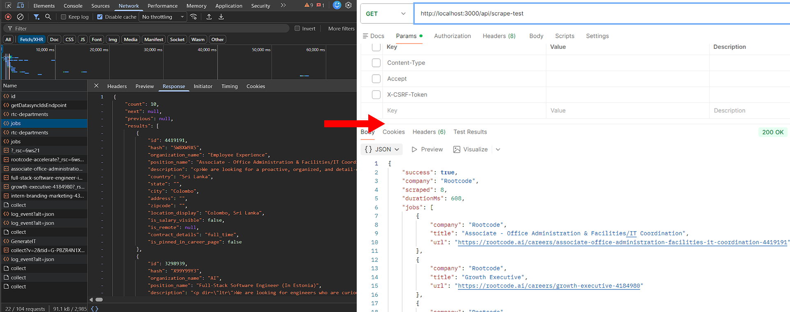
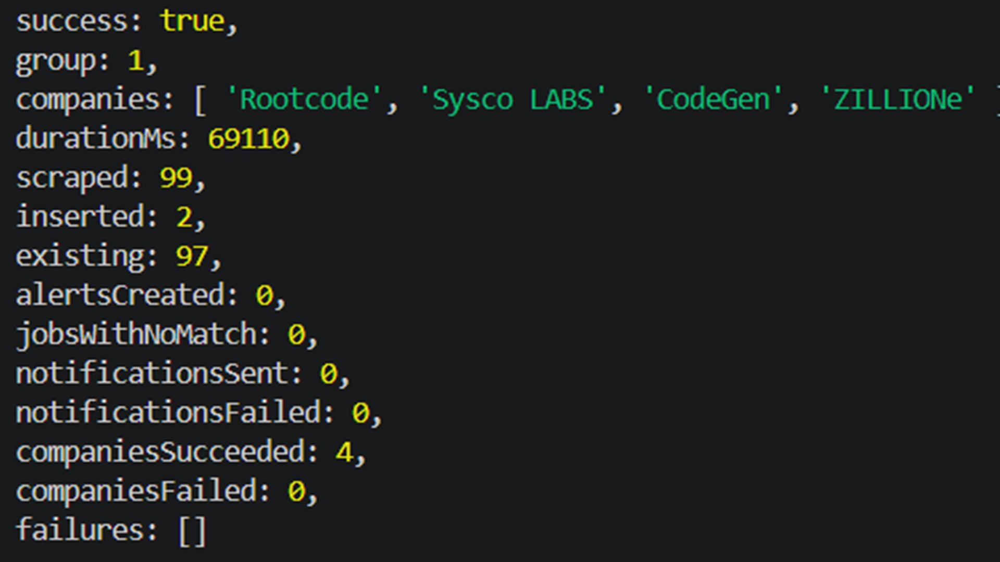
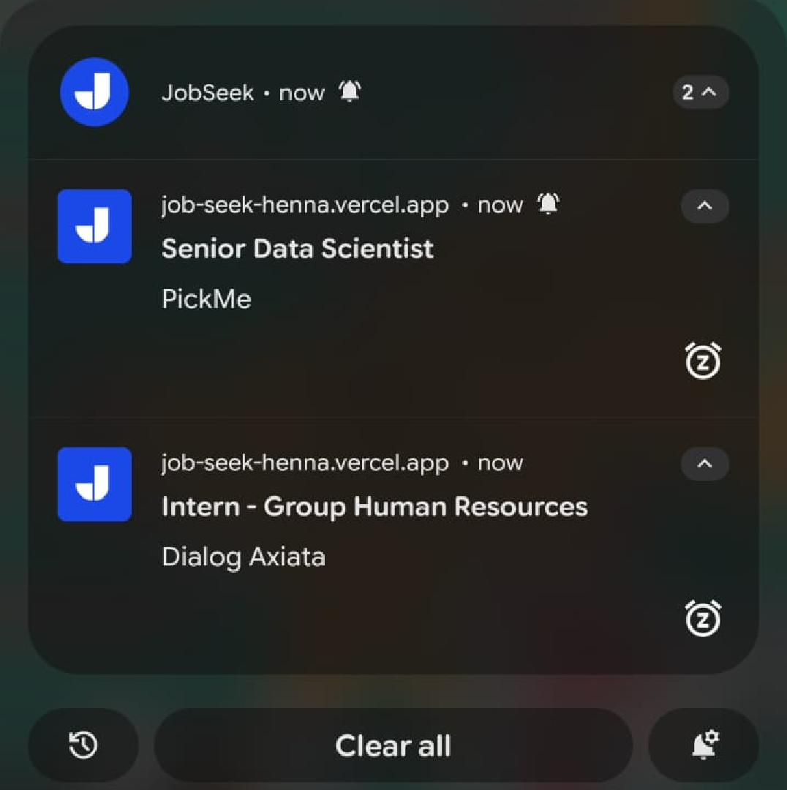
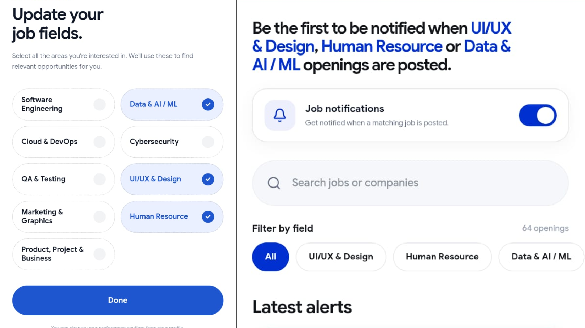
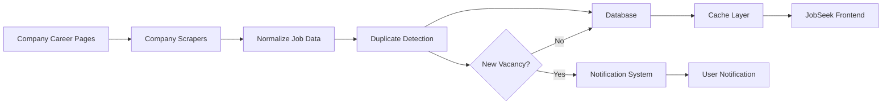
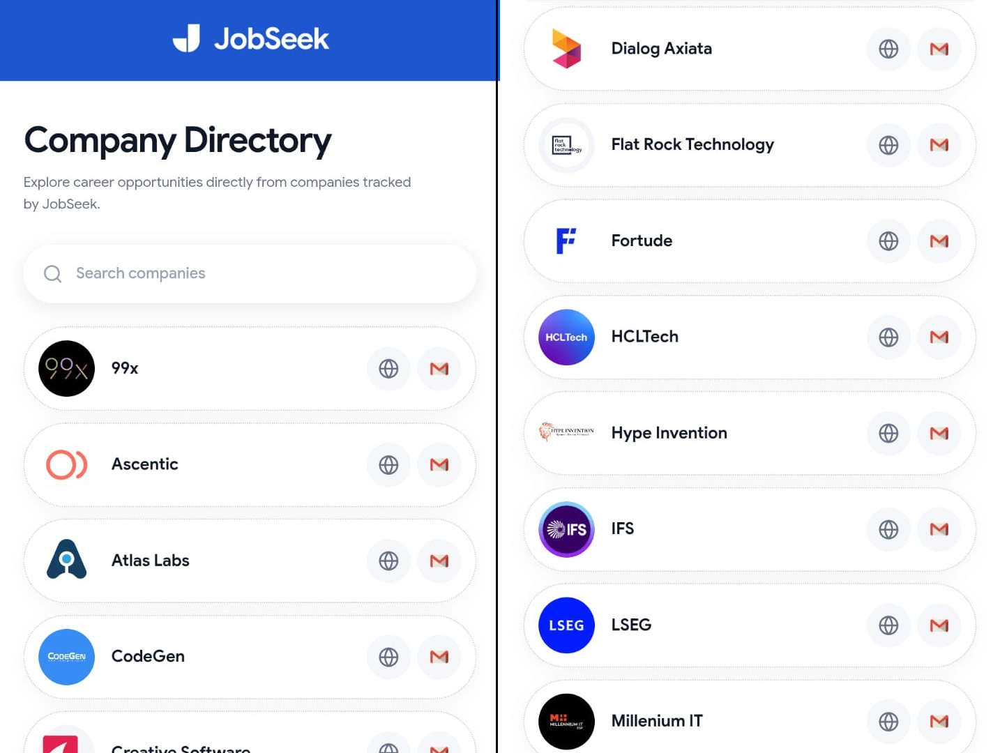

<div align="center">


[]()
[]()
[]()
[]()
[]()
[]()
[]()

<br>

[](https://job-seek-henna.vercel.app/overview)

🔗 https://job-seek-henna.vercel.app/overview

</div>

---

## 🎯 The Problem

Finding an internship or an early-career job often means repeatedly checking the career pages of different companies.

The process becomes:

- Open multiple company career pages
- Search through different job boards
- Repeat the same process every day
- Try to remember which companies were already checked
- Discover vacancies only after other applicants have already seen them

The information already exists.

The problem is **where it is scattered**.

---

## 🚀 Introducing JobSeek

**JobSeek is an automated career opportunity aggregation platform built around one simple idea:**

> **You shouldn't have to search every career page yourself.**

JobSeek continuously collects vacancies from company career pages during its scheduled scraping cycle, normalizes them into a common structure, filters them by relevant fields, and notify users about the new opportunity.

---

## What JobSeek Does

### 🔎 Aggregates vacancies

Each source can expose jobs differently:

- REST APIs
- RSS feeds
- Recruitment platforms
- Career pages
- Custom job widgets
- Different pagination systems
- Different response formats

JobSeek normalizes these different sources into a common job structure.



---

### ⚡ Detects new opportunities

The scraper system periodically checks company sources for new vacancies.

Previously discovered jobs can be recognized and skipped, while newly discovered opportunities can be processed and made available to users.

This means users don't have to manually remember what changed on every career page.



---

### 🔔 Notifies users about new vacancies

When a relevant new opportunity is detected, JobSeek can notify users instead of requiring them to repeatedly check the platform themselves.



---

## 🎯 Organizes jobs by field

JobSeek searches and classifies vacancies across **9 career fields**:

* Software Engineering
* Data Science & AI/ML 
* Cloud & DevOps
* QA & Testing
* Cybersecurity
* UI/UX & Design
* Marketing
* Human Resources
* Project Management



Each field is powered by **80+ carefully defined keywords**, covering different job titles, technologies, and terminology used across company career pages.

This allows JobSeek to automatically organize hundreds of scraped vacancies into the fields users actually care about, without requiring them to manually filter every job.


> Future improvement: The current classification is keyword-based. A future version could introduce an LLM-powered classification agent between the scraping and database stages, allowing the system to analyze the context of each job and determine which career field it belongs to, rather than relying entirely on predefined keywords.


---

## 🧠 How It Works



## ⚙️ Automated Scraping System

The scrapers are divided into **five groups**, with each group scheduled to run **five times throughout the day** using cron jobs. This distributes the workload instead of running every company scraper in a single execution.

```text
                         Cron Jobs
                            │
          ┌─────────────────┼─────────────────┐
          ▼                 ▼                 ▼
       Group 01          Group 02          Group 03
       Scrapers          Scrapers          Scrapers
          │                 │                 │
          └─────────────────┼─────────────────┘
                            │
                       Group 04 / 05
                            │
                            ▼
                     Vercel Function
                            │
                         200 OK
                            │
                     waitUntil(...)
                            │
                            ▼
                    Scraper Pipeline
                            │
              ┌─────────────┼─────────────┐
              ▼             ▼             ▼
          Scraping      Normalization   Database
                                          │
                                          ▼
                                      Alerts &
                                    Notifications
````

When a cron job triggers a scraper group, the **Vercel Function immediately acknowledges the request with `200 OK`** and uses `waitUntil()` to keep the scraping workflow running after the response has been returned.

This means the HTTP request does not have to remain open (which causes timeout error) while the system performs the full pipeline — **scraping companies, normalizing jobs, updating the database, creating alerts, and sending notifications**.

```
import { waitUntil } from "@vercel/functions";

 waitUntil(
    runScrapeGroup(
      GROUP_NUMBER,
      SOURCES
    )
  );
```

---

## Engineering Highlights

### 1. Concurrent & Fault-Tolerant Scraper Execution

JobSeek runs its company scrapers concurrently using Promise.allSettled() rather than Promise.all().

This means the scrapers do not have to wait for one another sequentially. The total scraping time is therefore generally bounded by the slowest scraper in that run, rather than the combined time of every scraper.

```
Sequential execution:

A ──────►
          B ──────►
                    C ─────────►
                                 D ───►
Total ≈ A + B + C + D


Concurrent execution:

A ──────►
B ───────────►
C ────────────────►
D ─────►

Total ≈ slowest scraper
```

At the same time, Promise.allSettled() ensures that a failure in one company scraper does not terminate the entire scraping run.

- Company A → ✅ 42 jobs
- Company B → ✅ 17 jobs
- Company C → ❌ request failed
- Company D → ✅ 31 jobs
- Company E → ✅ 12 jobs


```
const results = await Promise.allSettled(
  sources.map(async ([companyName, scraper]) => {
    const jobs = await scraper();

    return {
      companyName,
      jobs,
    };
  })
);
```
This gives JobSeek two important properties:
- Concurrent execution for faster scraping
- Failure isolation so one unreliable company source does not bring down the entire pipeline.

### 2. Job Lifecycle & Stale Job Detection

JobSeek tracks whether previously discovered vacancies are still active, rather than simply creating new records on every scrape.

When a scraper runs, the current results are compared with existing jobs:

```text
Found today      → is_active = true
Not found tomorrow  → is_active = false
```

Instead of deleting stale jobs, JobSeek keeps the record and marks it inactive. This preserves job history while ensuring users only see **currently active opportunities**.


### 3. Client-Side Caching

JobSeek uses a shared **in-memory application cache** to make navigation feel fast.

When users move between pages such as Alerts, Saved, Career and Profile, previously loaded data can be reused instead of requesting the same data from Supabase again.

The cache also uses different **TTL values** depending on how frequently the data is expected to change:

TTL values:
- Alerts    → 5 minutes
- Saved     → 30 seconds
- Career    → 1 hour
- Profile   → 10 minutes

For example, when the Alerts page is opened, JobSeek can immediately render the cached jobs and then refresh the data in the background when the cache becomes stale.

---


## 🏢 Company Directory

JobSeek provides a centralized directory of tracked companies along with their career pages and email addresses.

All relevant company information is organized in one place, making it easier to discover opportunities and apply without repeatedly searching across different company websites.



---

## 🛠️ Tech Stack

| Technology       | Purpose                                  |
| ---------------- | ---------------------------------------- |
| **Next.js**      | Frontend application and routing         |
| **React**        | User interface                           |
| **JavaScript**   | Application logic                        |
| **Supabase**     | Database and backend services            |
| **Cron Jobs**    | Automated scraper scheduling             |
| **REST APIs**    | Career platform data collection          |
| **RSS**          | Structured career feed ingestion         |
| **Web Scraping** | Career page extraction                   |
| **Caching**      | Faster job retrieval and user experience |
| **Vercel**       | Application deployment                   |

---

## ⏳ Future Improvements

Some areas that can be expanded as JobSeek grows:

* More companies and career sources
* More granular personalization
* Advanced filtering
* Better job relevance ranking
* More source-specific scraper adapters
* Analytics for job discovery
* Personalized opportunity recommendations

---

ⓘ Note

This repository contains the frontend codebase of JobSeek for demonstration and portfolio purposes.
The company scraper implementations and scraping logic are maintained in a separate private repository and are therefore not included here.

---


<div align="center">
  <h2>Contact Me</h2>
  <p>Have inquiries or feedback? Feel free to reach out!</p>
  
  <a href="https://mail.google.com/mail/?view=cm&fs=1&to=abdlraheem26@gmail.com&su=Inquiry%20regarding%20JobSeek" target="_blank" rel="noopener noreferrer">
    
  </a>
</div>

---